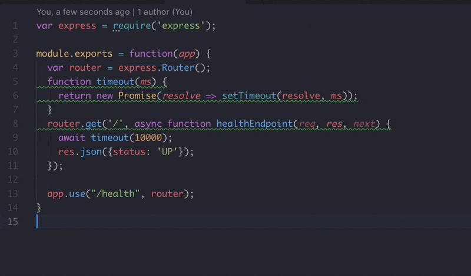

# Codewind Language Server for Node.js Profiling

Annotates your Node.js code with code highlighting for your hottest functions in your Codewind projects.

This extension provides code highlighting showing relative time spent in JavaScript functions based on profiling data gathered through Codewind Load Testing.

## Usage

With Visual Studio Code:

- Open a local project created with [Codewind](https://microclimate-dev2ops.github.io/installlocally), and profiled using the [Performance Test](https://microclimate-dev2ops.github.io/performancetesting#performance-testing-your-project) feature.
- This will create profiling data in a `load-test/[datestamp]/profiling.json` file in your Codewind project.
- In Visual Studio Code open a JavaScript file in your project.
- The extension will highlight any lines which were found in the profiling data and annotate them to show how often they were seen and where they were called from.
